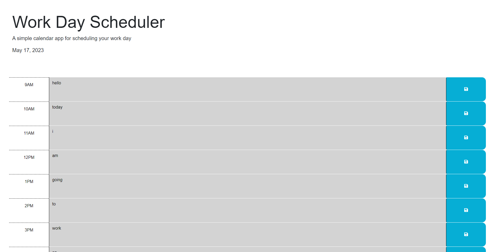

# Work Day Scheduler

## Description
This workday scheduler web application was created to give users the ability to schedule a typical workday, perfect for people who find themselves busy at work and need a way to schedule tasks for their day by the hour. Users can save hourly tasks and come back to them later, in order to eliminate unstructured or wasted time during the workday. Working on this project allowed me to learn more about using JQuery, Bootstrap, and DayJS APIs.

## Usage
This web application can be accessed at the URL (https://ronbuttermore.github.io/workday-scheduler/). The current day can be viewed by the user in the header at the top of the page, which will update on refresh. The user can input tasks in the text box for each hour to schedule out their workday, and then click on the "save" icon to the right of the text box to save their tasks. If the user closes the page and re-opens it, they will see their tasks saved for each hour.

## Credits
The HTML and CSS for this application was mostly built by the University of Denver Coding bootcamp staff, while I wrote all of the JavaScript code that creates the functionality of the webpage.

## License
MIT Open-Source License

Copyright (c) 2023 Ron Buttermore

Permission is hereby granted, free of charge, to any person obtaining a copy of this software and associated documentation files (the "Software"), to deal in the Software without restriction, including without limitation the rights to use, copy, modify, merge, publish, distribute, sublicense, and/or sell copies of the Software, and to permit persons to whom the Software is furnished to do so, subject to the following conditions:

The above copyright notice and this permission notice shall be included in all copies or substantial portions of the Software.

THE SOFTWARE IS PROVIDED "AS IS", WITHOUT WARRANTY OF ANY KIND, EXPRESS OR IMPLIED, INCLUDING BUT NOT LIMITED TO THE WARRANTIES OF MERCHANTABILITY, FITNESS FOR A PARTICULAR PURPOSE AND NONINFRINGEMENT. IN NO EVENT SHALL THE AUTHORS OR COPYRIGHT HOLDERS BE LIABLE FOR ANY CLAIM, DAMAGES OR OTHER LIABILITY, WHETHER IN AN ACTION OF CONTRACT, TORT OR OTHERWISE, ARISING FROM, OUT OF OR IN CONNECTION WITH THE SOFTWARE OR THE USE OR OTHER DEALINGS IN THE SOFTWARE.
